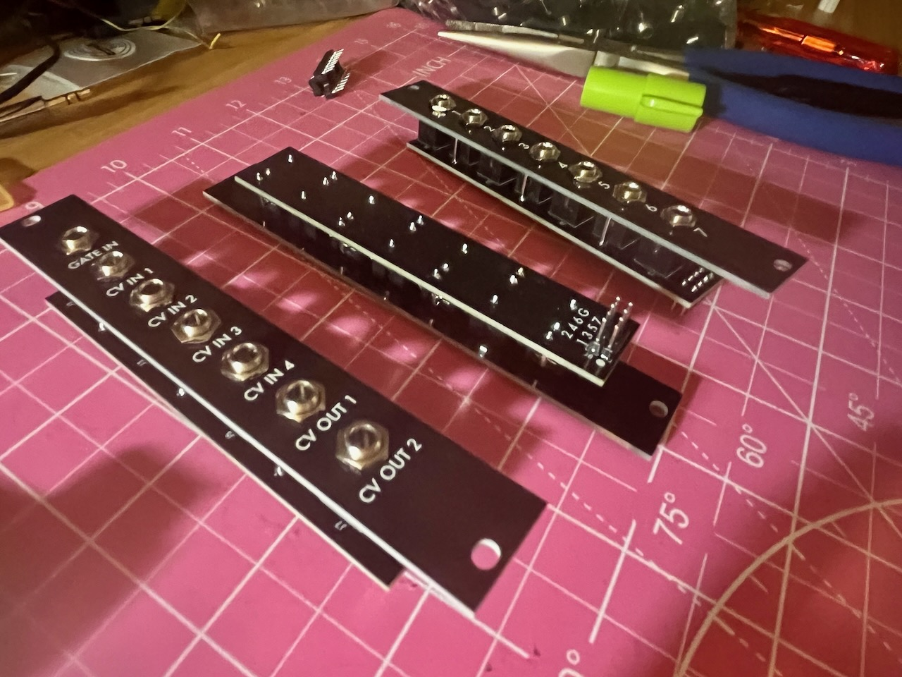
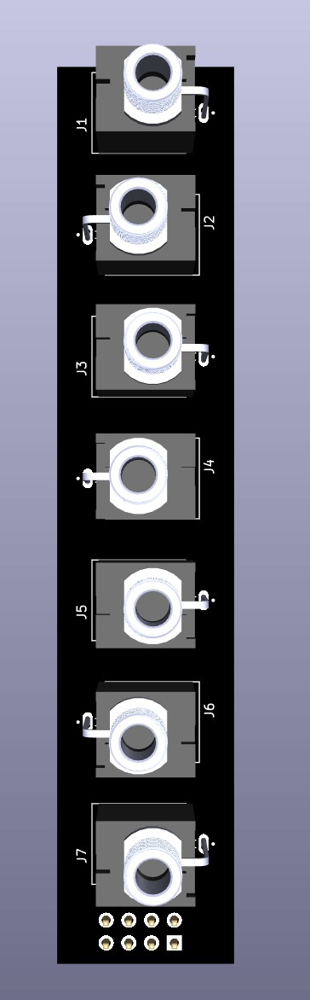

# Passive expander for Eurorack

It’s 4hp and has 7 patch cable sockets and 8 pins on the back. One for each of the 7, plus a pin for connecting a ground that is sent to each of the sockets. We found it useful in working on [Time Machine](https://github.com/oamodular/time-machine) but this is also a handy tool for bringing *any* expander pins to the front of your system.

On one side of the faceplate the sockets are number 1 through 7. On the other it has labels specific to Time Machine. Meep morp

